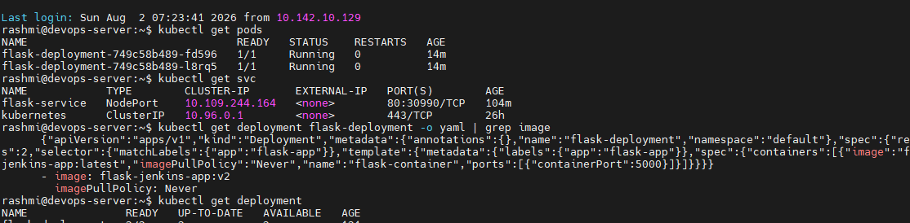
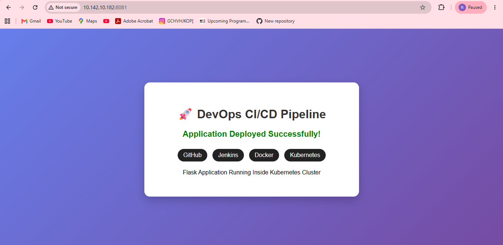
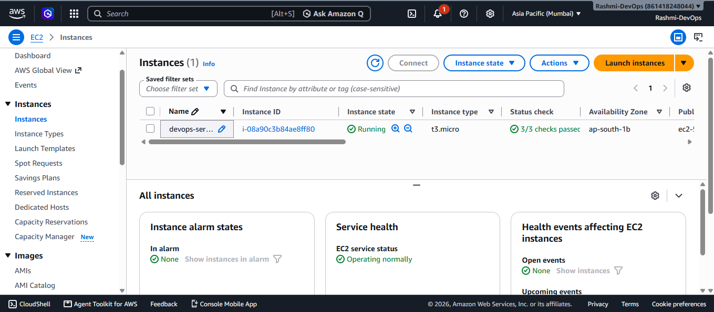
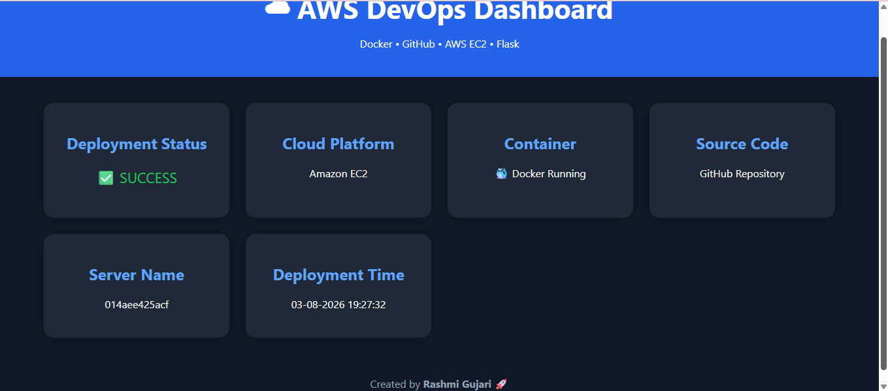

# 🚀Project 1 :-  CI/CD Pipeline using Jenkins + Docker

## 📌 Project Overview

This project demonstrates a complete CI/CD (Continuous Integration and Continuous Deployment) pipeline for a Python Flask application using **GitHub, Jenkins, and Docker**.

Whenever code is pushed to the GitHub repository, Jenkins automatically triggers the pipeline, checks out the latest source code, builds a Docker image, tests the application, deploys the Docker container, and performs cleanup.

---

## 🛠️ Technologies Used

* Ubuntu Linux
* Git
* GitHub
* Jenkins
* Docker
* Python
* Flask

---

## 🔄 CI/CD Workflow

```text
Developer
    │
    ▼
GitHub Repository
    │
    ▼
Jenkins Pipeline
    │
    ├── Checkout SCM
    ├── Git Check
    ├── Build Docker Image
    ├── Test Application
    ├── Deploy Docker Container
    └── Cleanup
    │
    ▼
Running Flask Application
```
---

## 📂 Project Structure

```text
devops-project-ci-cd-pipeline-jenkins-docker
│
├── app.py
├── Dockerfile
├── Jenkinsfile
├── requirements.txt
├── README.md
└── screenshots
    ├── jenkins-success.png
    ├── jenkins-build-details.png
    ├── docker-container.png
    └── flask-output.png
```

---

## ✅ Pipeline Stages

* Checkout SCM
* Git Check
* Build Docker Image
* Test Application
* Deploy Docker Container
* Cleanup
* Post Actions

---

## 🐳 Docker Commands

### Build Docker Image

```bash
docker build -t flask-jenkins-app .
```

### Run Docker Container

```bash
docker run -d --name flask-container -p 5000:5000 flask-jenkins-app
```

### Check Running Containers

```bash
docker ps
```

---

## ▶️ Access the Application

Open your browser and visit:

```text
http://<SERVER-IP>:5000
```

Example:

```text
http://10.142.10.182:5000
```

---

## 📸 Project Screenshots

### ✅ Jenkins Successful Build


---

### ✅ Jenkins Build Details


---

### ✅ Docker Running Container


---

### ✅ Flask Application Output


---

## 🎯 Project Outcome

* Implemented an automated CI/CD pipeline using Jenkins.
* Configured GitHub SCM trigger for automatic builds.
* Built Docker images automatically.
* Performed automated application testing.
* Deployed the Flask application using Docker containers.
* Cleaned up unused Docker images after deployment.

---

## Project 2 :- Kubernetes Deployment

Application deployed on Kubernetes using Minikube.

### Implementation Steps

1. Built Docker image for Flask application
2. Loaded Docker image into Minikube
3. Created Kubernetes Deployment
4. Created Kubernetes Service
5. Updated application using rolling deployment
6. Verified application running inside Kubernetes cluster

### Kubernetes Components Used

- Minikube
- Kubernetes Deployment
- Kubernetes Pods
- Kubernetes Service
- kubectl commands

## 📸 Screenshots

### Kubernetes Pods Running




### Kubernetes Service


### Flask Application Running on Kubernetes




## 🎯 Project Outcome

- Successfully deployed the Flask application on Kubernetes using Minikube.
- Created and managed Kubernetes Deployments and Services.
- Learned Kubernetes architecture including Pods, Deployments, and Services.
- Performed application updates using Kubernetes rolling deployment.
- Verified application accessibility inside the Kubernetes cluster.
- Gained hands-on experience with `kubectl` commands and YAML configuration files.

---

# ☁️ Project 3 :- AWS EC2 Docker Deployment

## 📌 Project Overview

This project demonstrates deployment of a Python Flask application on an AWS EC2 Ubuntu server using Docker.

The application source code was cloned from GitHub into an AWS EC2 instance, Dockerized, and deployed successfully. The application was then accessed using the EC2 Public IP address.

---

## 🛠️ Technologies Used

- AWS EC2
- Ubuntu Server
- Docker
- Git
- GitHub
- Python
- Flask
- MobaXterm (SSH)

---

## 🚀 Implementation Steps

- Created AWS Free Tier account
- Completed AWS customer verification
- Launched Ubuntu EC2 instance
- Created and downloaded EC2 Key Pair
- Connected EC2 using MobaXterm via SSH
- Verified Docker and Git installation
- Cloned project from GitHub
- Built Docker image
- Started Docker container
- Configured AWS Security Group
- Allowed Port 5000
- Accessed application using EC2 Public IP

---

## 🐳 Docker Commands Used

Clone Repository

```bash
git clone https://github.com/rashmigujuri14/devops-project-ci-cd-pipeline-jenkins-docker.git
```

Build Docker Image

```bash
docker build -t flask-app .
```

Run Docker Container

```bash
docker run -d -p 5000:5000 --name flask-container flask-app
```

Check Running Container

```bash
docker ps
```

Check Application

```bash
curl http://localhost:5000
```

---

## ☁️ AWS Services Used

- EC2
- Security Groups
- Key Pair
- Public IPv4

---

## 📸 Screenshots

### 🖥️ EC2 Instance Running



---

### 🔐 SSH Connected using MobaXterm


---

## 🎯 Project Outcome

- Successfully launched an AWS EC2 Ubuntu instance.
- Connected securely to the EC2 instance using SSH through MobaXterm.
- Cloned the project repository from GitHub to the EC2 server.
- Built and deployed the Flask application using Docker.
- Configured AWS Security Groups to allow application access.
- Successfully accessed the application through the EC2 Public IP address.
- Gained hands-on experience with cloud deployment on AWS EC2.
---

# 👩‍💻 Author

**Rashmi Gujari**

Project 1 - Jenkins + Docker
Project 2 - Kubernetes
Project 3 - AWS EC2 Docker Deployment

GitHub: https://github.com/rashmigujuri14

LinkedIn: https://www.linkedin.com/in/rashmi-gujari-4b89bb373/
