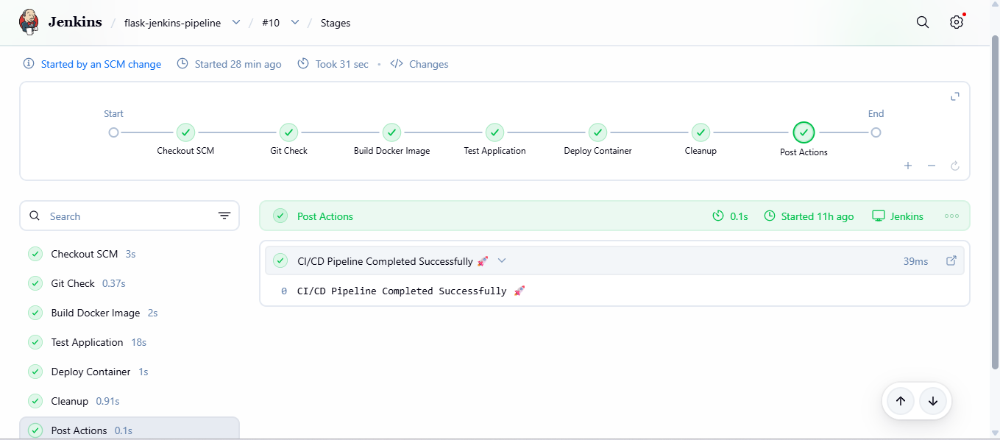
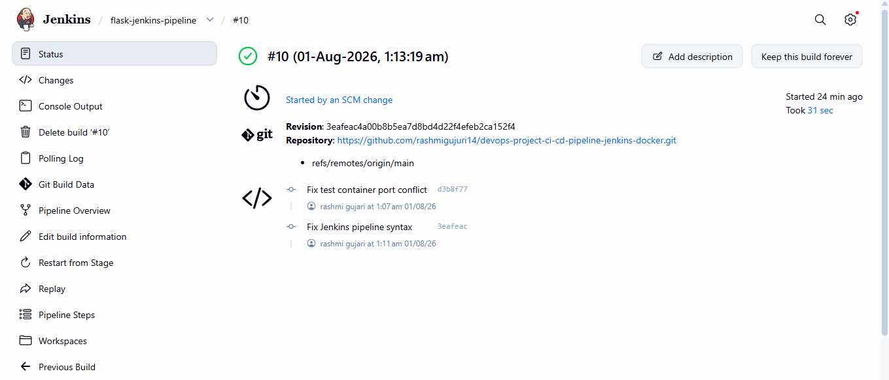
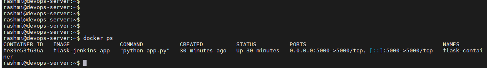

# 🚀 CI/CD Pipeline using Jenkins + Docker

## 📌 Project Overview

This project demonstrates a complete CI/CD (Continuous Integration and Continuous Deployment) pipeline for a Python Flask application using **GitHub, Jenkins, and Docker**.

Whenever code is pushed to the GitHub repository, Jenkins automatically triggers the pipeline, checks out the latest source code, builds a Docker image, tests the application, deploys the Docker container, and performs cleanup.

---

## 🛠️ Technologies Used

* Ubuntu Linux
* Git
* GitHub
* Jenkins
* Docker
* Python
* Flask

---

## 🔄 CI/CD Workflow

```text
Developer
    │
    ▼
GitHub Repository
    │
    ▼
Jenkins Pipeline
    │
    ├── Checkout SCM
    ├── Git Check
    ├── Build Docker Image
    ├── Test Application
    ├── Deploy Docker Container
    └── Cleanup
    │
    ▼
Running Flask Application
```
---

## 📂 Project Structure

```text
devops-project-ci-cd-pipeline-jenkins-docker
│
├── app.py
├── Dockerfile
├── Jenkinsfile
├── requirements.txt
├── README.md
└── screenshots
    ├── jenkins-success.png
    ├── jenkins-build-details.png
    ├── docker-container.png
    └── flask-output.png
```

---

## ✅ Pipeline Stages

* Checkout SCM
* Git Check
* Build Docker Image
* Test Application
* Deploy Docker Container
* Cleanup
* Post Actions

---

## 🐳 Docker Commands

### Build Docker Image

```bash
docker build -t flask-jenkins-app .
```

### Run Docker Container

```bash
docker run -d --name flask-container -p 5000:5000 flask-jenkins-app
```

### Check Running Containers

```bash
docker ps
```

---

## ▶️ Access the Application

Open your browser and visit:

```text
http://<SERVER-IP>:5000
```

Example:

```text
http://10.142.10.182:5000
```

---

## 📸 Project Screenshots

### ✅ Jenkins Successful Build



---

### ✅ Jenkins Build Details



---

### ✅ Docker Running Container



---

### ✅ Flask Application Output


---

## 🎯 Project Outcome

* Implemented an automated CI/CD pipeline using Jenkins.
* Configured GitHub SCM trigger for automatic builds.
* Built Docker images automatically.
* Performed automated application testing.
* Deployed the Flask application using Docker containers.
* Cleaned up unused Docker images after deployment.

---

## 👩‍💻 Author

**Rashmi Gujari**

GitHub: https://github.com/rashmigujuri14


## Kubernetes Deployment

Application deployed on Kubernetes using Minikube.

### Implementation Steps

1. Built Docker image for Flask application
2. Loaded Docker image into Minikube
3. Created Kubernetes Deployment
4. Created Kubernetes Service
5. Updated application using rolling deployment
6. Verified application running inside Kubernetes cluster

### Kubernetes Components Used

- Minikube
- Kubernetes Deployment
- Kubernetes Pods
- Kubernetes Service
- kubectl commands

### Screenshots

Kubernetes Pods Running

Kubernetes Service

Flask Application Running on Kubernetes
